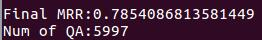
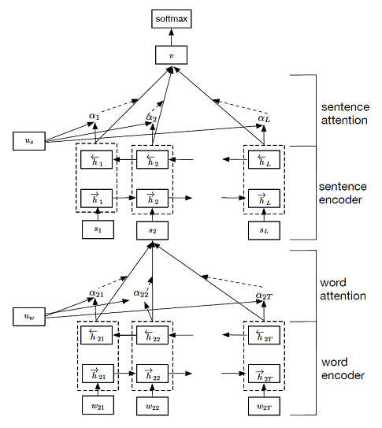

# 第三次作业 小组报告

### 1  成员姓名和学号

| 姓名   | 学号       |
| ------ | ---------- |
| 张通   | 1701110692 |
| 刘澍   | 1701214258 |
| 洪志龙 | 1701210335 |
| 王业隆 | 1701210060 |

### 2  问题描述

本次实验为NLPCC2017 Task 5中的DBQA，即基于文档的问答，针对问题从给定文档中选择包含答案的句子。训练集和测试集中每行都包含问题、答案和是否为正确答案的标签，训练模型并预测每个答案和问题之间的关联得分，计算MRR (Mean Reciprocal Rank)和MAP (Mean Average Precision)，MAP和MRR的定义如下所示：

$$
\begin{align}
MRR &= \frac{1}{|Q|} \sum_{i=1}^{|Q|}\frac{1}{rank_i} \\
MAP &= \frac{1}{|Q|} \sum_{i=1}^{|Q|}AvcP(C_i, A_i)
\end{align}
$$

### 3  基于CNN的模型

#### 3.1  主要思路

建立卷积神经网络，将问题和备选句子转化为向量表示，通过向量相似度计算备选句子的分值。目标是使得正确答案与问题向量的余弦相似度尽可能大的同时，错误答案与问题向量的余弦相似度尽可能小。 

CNN结构如下：

- **Lookup Layer ** :  随机初始化字的embedding向量，d=150 
- **Convolution Layer** : 分别使用大小为1`*`150, 2`*`150, 3`*`150, 4`*`150, 5`*`150的卷积核，每种卷积核数量为300，卷积核的步长在两个维度上都为1。卷积后用Relu激活函数激活。
- **Pooling Layer** : 采用最大值池化

#### 3.2  实验环境

- Python 3.5 
- TensorFlow 1.4
- Numpy, etc.

#### 3.3  实验结果

模型在训练集`nlpcc-iccpol-2016.dbqa.training-data`上进行训练，在`nlpcc-iccpol-2016.dbqa.testing-data`预测每个答案的分值并计算MRR，最终得到的结果为 **0.7854**，运行结果截图如下：

### 4   基于HAN的模型

#### 4.1  主要思路

使用Hierarchical Attention Networks的结构，分为Query端和Answer端，Query端使用Attention-based bi-LSTM，Answer端使用Hierarchical Attention-based bi-LSTM。

#### 4.2  实验方法

Query端，记Query序列$q = \{x_1^q, x_2^q, \cdots, x_n^q\}$，我们将第$i$个单词的One-hot表示$x_i^q$经过Word Embedding矩阵变为分布式表示$w_i^q$，然后经过带Attention的bi-LSTM得到Query端表示，具体公式如下：
$$
\begin{align}
\overrightarrow{{o}}_i^{q}, \overrightarrow{{h}}_i^{q} &= {\rm LSTM}_{word}({w}^q_i,\overrightarrow{{h}}_{i-1}^{q}) \\
\overleftarrow{{o}}_i^{q}, \overleftarrow{{h}}_i^{q} &= {\rm LSTM}_{word}({w}^q_i,\overleftarrow{{h}}_{i+1}^{q}) \\
{h}_i^{q} &= [\overrightarrow{{h}}_i^{q}; \overleftarrow{{h}}_i^{q}] \\
{o}_i^{q} &= [\overrightarrow{{o}}_i^{q}; \overleftarrow{{o}}_i^{q}] \\
{u}_i^{q} &= \tanh ({W}_q {o}_i^{q}+{b}_q)  \\
\alpha_i^{q} &= \frac{\exp \left(({u}_i^q)^T {u}_q\right)}{\sum_j \exp \left(({u}_j^q)^T{u}_q\right)} \\
{c}^q &= \sum_i \alpha_i^q {o}_i^q
\end{align}
$$
其中$W_q$和$b_q$分别为Self Attention的权重矩阵和偏置矩阵，$u_w$是一个随机初始化的向量，均在训练阶段进行学习。

Answer端，记Answer序列$a = \{s_1^a, s_2^a, \cdots, s_m^a\}$，其中$s_i^a$表示Answer序列的第$i$句话，$s^a = \{x_1^a, x_2^a, \cdots, x_n^a\}$， 我们将第$i$个单词的One-hot表示$x_i^a$经过Word Embedding矩阵变为分布式表示$w_i^a$，然后经过Hierarchical Attention-based bi-LSTM得到Answer的表示，具体公式如下：

句子级别
$$
\begin{align}
\overrightarrow{{o}}_i^{a}, \overrightarrow{{h}}_i^{a} &= {\rm LSTM}_{word}({w}^a_i,\overrightarrow{{h}}_{i-1}^{a}) \\
\overleftarrow{{o}}_i^{a}, \overleftarrow{{h}}_i^{a} &= {\rm LSTM}_{word}({w}^a_i,\overleftarrow{{h}}_{i+1}^{a}) \\
{h}_i^{a} &= [\overrightarrow{{h}}_i^{a}; \overleftarrow{{h}}_i^{a}] \\
{o}_i^{a} &= [\overrightarrow{{o}}_i^{a}; \overleftarrow{{o}}_i^{a}] \\
{u}_i^{a} &= \tanh ({W}_a {o}_i^{a}+{b}_a)  \\
\alpha_i^{a} &= \frac{\exp \left(({u}_i^a)^T {u}_a\right)}{\sum_j \exp \left(({u}_j^a)^T{u}_a\right)} \\
{c}^a &= \sum_i \alpha_i^a {o}_i^a
\end{align}
$$
文档级别
$$
\begin{align}
\overrightarrow{{o}}_i^{a}, \overrightarrow{{h}}_i^{a} &= {\rm LSTM}_{word}({c}^a_i,\overrightarrow{{h}}_{i-1}^{a}) \\
\overleftarrow{{o}}_i^{a}, \overleftarrow{{h}}_i^{a} &= {\rm LSTM}_{word}({c}^a_i,\overleftarrow{{h}}_{i+1}^{a}) \\
{h}_i^{a} &= [\overrightarrow{{h}}_i^{a}; \overleftarrow{{h}}_i^{a}] \\
{o}_i^{a} &= [\overrightarrow{{o}}_i^{a}; \overleftarrow{{o}}_i^{a}] \\
{u}_i^{a} &= \tanh ({W}_a {o}_i^{a}+{b}_a)  \\
\alpha_i^{a} &= \frac{\exp \left(({u}_i^a)^T {u}_a\right)}{\sum_j \exp \left(({u}_j^a)^T{u}_a\right)} \\
{c}^{ad} &= \sum_i \alpha_i^a {o}_i^a
\end{align}
$$
然后将$c^{ad}$和$c^a$连接起来作为一个新的向量$c$，将向量$c$过一个线性分类器，进行二分类，使用softmax作为目标函数：
$$
p(\hat{y}|{w}, {s}) = softmax({W}^q {c}^q + {W}^{ad} {c}^{ad} + {b})
$$
损失函数为：
$$
\mathcal{L}(\theta) = -y \log p(y|{w}, {s}, {\theta})
$$

网络结构如下图所示：

### 5  基于句法结构的模型

#### 5.1  主要思路

基于结巴分词对训练集和测试集的数据进行分词，并利用Stanford CoreNLP分析所有问题的句法结构和依赖结构。然后根据句法结构和依赖结构提取三个特征，最终利用特征和标签训练GBDT分类模型，对测试集进行评分计算MRR和MAP。

#### 5.2  预处理

预处理主要包括三部分：

- 首先将数据按照问题-答案-标签的格式提取出来，然后将所有问题保存成一个文件供Stanford CoreNLP分析。由于Stanford CoreNLP会按照问号、句号等标点作为一句话的结尾，因此需要提前将一句话中间的问号和句号进行筛除。
- 然后用Stanford CoreNLP处理包含问题的文件，得到句法分析和依赖结构分析的结果。
- 最后将问题、问题对应的答案集、句法结构和依赖结构合并在一起，形成源数据。（`dataset.py`和`semantic.py`中包含了所有数据结构）

预处理三个阶段在`preprocess`文件夹中。

#### 5.3  模型细节

提取的特征主要有3个：

1. 句法结构中的主谓关系：首先找到所有动词短语（VP），然后找到与动词短语相关联的名词短语（NP），可以认为NP和VP之间存在主谓关系，然后计算NP和每个答案中所有词语的相似度，并取最大值；
2. 依赖结构中的动宾关系：找到所有的直接宾语结构（dobj），也就是动宾结构，然后分析动词和宾语与每个答案中所有词语的相似度，并取最大值；
3. 每个答案的信息量：计算一个问题下面所有答案中词语出现的频率，如果频率越高，说明这个词语的信息量越低；然后计算每个答案中与问题重合的词语的信息量。

词语相似度则通过Word2Vec将词语转换成词向量然后计算。本次实验中使用的是已经训练好的[基于知乎问答的Word2Vec模型](https://github.com/Embedding/Chinese-Word-Vectors)，对于模型中未命中词则退化成单字相似度，即词语中相似单字的数量除以整个词语的单字数量。

提取特征后用GBDT（Gradient Boosting Decision Tree）分类器对训练集的特征进行训练得到最终模型。

特征提取和训练在`model.py`中实现，相似度计算在`similarity.py`中实现，数据和模型的保存则在`persistence.py`中实现。

#### 5.4  实验环境

- [jieba](https://github.com/fxsjy/jieba)（结巴分词）
- [nltk](https://www.nltk.org/_modules/nltk/parse/corenlp.html) （Stanford CoreNLP接口）
- [gensim](https://radimrehurek.com/gensim/models/word2vec.html) （Word2Vec相似度）
- [scikit-learn](http://scikit-learn.org/stable/modules/generated/sklearn.ensemble.GradientBoostingClassifier.html)（GBDT分类）
- [Stanford CoreNLP](http://stanfordnlp.github.io/CoreNLP/) （句法分析和依赖结构分析）

#### 5.5  实验结果

利用`nlpcc-iccpol-2016.dbqa.training-data`进行训练，在`nlpcc-iccpol-2016.dbqa.testing-data`上预测每个答案的分值并输出到文件中，然后计算整体的MRR和MAP，得到结果为：

| 模型           | MRR   | MAP   |
| -------------- | ----- | ----- |
| Semantic Model | 0.662 | 0.665 |

可以看到，基于语法结构的模型可以较为准确地预测正确答案，但是仍可能会有进步的空间，包括在特征中对命名实体进行筛除、提取更多相关性强的特征以及对GBDT进行调参等等方式。

#### 5.6  参考资料

[1] Shen Li, Zhe Zhao, Renfen Hu, Wensi Li, Tao Liu, Xiaoyong Du, Analogical Reasoning on Chinese Morphological and Semantic Relations, accepted by ACL 2018. 

[2] Manning, Christopher D., Mihai Surdeanu, John Bauer, Jenny Finkel, Steven J. Bethard, and David McClosky. 2014. The Stanford CoreNLP Natural Language Processing Toolkit In Proceedings of the 52nd Annual Meeting of the Association for Computational Linguistics: System Demonstrations, pp. 55-60.

\[3\] [AuCson/BoP2017-Qualification-DBQA](https://github.com/AuCson/BoP2017-Qualification-DBQA)

\[4\] [MAP(Mean Average Precision) ](https://blog.csdn.net/starzhou/article/details/51558129)

\[5\] [Stanford-parser依存句法关系解释 ](https://blog.csdn.net/lihaitao000/article/details/51812618)

### 6  模型对比

| 模型           | MRR    |
| -------------- | ------ |
| CNN            | 0.7854 |
| Semantic Model | 0.662  |

可以看到，基于CNN的模型表现要好于基于句法结构的模型，因此最终在评审数据集上我们采用基于CNN的模型对数据进行预测，得到的Relevance Score保存在`result.txt`中。

