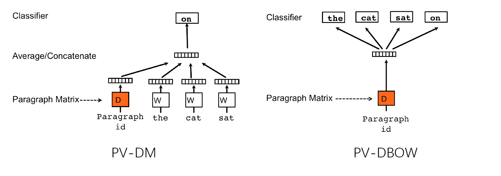
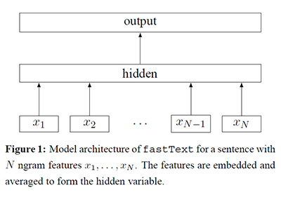

# 第二次作业 报告

[TOC]

## 1  作业要求

### 任务要求

本次作业来自SemEval2017 Task 4 Subtask A，其任务要求为：给定一个推特，判断推特的情感倾向为Positive、Neutral还是Negative的。

### 数据集

训练集和测试集都是有标注的数据，其中训练集包括了2013年-2016年的数据集，共50333条，而测试集则有12284条。数据集中每一项数据的格式为：编号 -  情感倾向 - 语料，例如：

> 638061181823922176 positive Jay Z joins Instagram with nostalgic tribute to Michael Jackson: Jay Z apparently joined Instagram on Saturday and.. http://t.co/Qj9I4eCvXy

无论是训练集还是测试集，其样本分布都是不均匀的，如下表所示：

| Dataset | Positive | Neutral | Negative | Total |
| ------- | -------- | ------- | -------- | ----- |
| Train   | 19902    | 22591   | 7840     | 50333 |
| Test    | 2375     | 5937    | 3972     | 12284 |

可以看到，在训练集中，情感倾向为Neutral的数据所占比重最大，其次是Positive，最后是Negative，这在一定程度上会影响最终模型的表现。

### 评判标准

对于Task A来说共有三个评判标准，最主要的是$AvgRec$，$AvgRec = \frac{1}{3}(R^P+R^N+R^U)$，即三个分类各自$Recall$的算术平均值。相比于$Accuracy$来说，当类别比重不平衡时，$AvgRec$要更鲁棒一些。其次是$F^{PN}_{1}$和$Accuracy$。$F^{PN}_1$又称为Macro-average $F_1$，$F_1^{PN} = \frac{1}{2}(F_1^P+F_1^N)$，即只考虑Positive和Negative两个分类，而不考虑Neutral分类。Accuracy即准确度。

## 2  工具集

本次实验共使用了两种计算方式，第一种是借助Doc2Vec将文本转化成向量然后再利用GDBT对情感分类进行有监督的学习；第二种是借助FastText的文本分类模型来进行分类。Doc2Vec来自[gensim](https://radimrehurek.com/gensim/models/doc2vec.html)的实现，GDBT调用的是scikit-learn的[GradientBoostingClassifier](http://scikit-learn.org/stable/modules/generated/sklearn.ensemble.GradientBoostingClassifier.html)，而[FastText](https://github.com/facebookresearch/fastText/tree/master/python)使用了Facebook的Python接口对训练集进行训练。训练完成后，通过scikit-learn的[accuracy_score](http://scikit-learn.org/stable/modules/generated/sklearn.metrics.accuracy_score.html)和[classification_report](http://scikit-learn.org/stable/modules/generated/sklearn.metrics.classification_report.html)对AvgRec、Accuracy和$F_1^{PN}$这三个评判标准进行计算。

## 3  实现方法

### 数据预处理

由于数据集来自Twitter的原始数据，因此其中含有一些对实验结果有影响的“噪声”，以其中两条推文为例：

> 256075828117508096 neutral Remember this? Santorum: Romney\u002c Obama healthcare mandates one and the same http://t.co/sIoG48TO #TheRealRomney @Lis_Smith @truthteam2012
>
> 802032523152718976  neutral Ariana lips💄#mac #ariana #arianagrande https://t.co/T4aK8LagqX

可以看到，推文中包含有\#、@和网址等影响训练和测试过程的字符，需要进行处理来提升模型表现。

实验中预处理主要包括以下规则：

* 将网址替换为统一格式：有些推文含有推主分享的网址，形式基本为http://t.co/abcdefgh，在Doc2Vec和FastText中每一个网址都会被识别成一个新单词，因此将其统一替换为语料中不会出现的'urlpattern'
* 将 @用户名 去掉：用户名一般都不具有任何实际含义，因此统一去掉
* 将 \#话题 中的\#去掉：\#话题一般表达了整个推文的主题，因此只去掉\#，避免被识别成新的词语
* 将标点符号统一去掉：由于推文不是正式文字，用户在使用标点符号时常常不规范，并且标点符号所代表的意义比较多样（例如叹号既可表达喜悦又可以表达愤怒），权衡再三决定还是去掉
* 将Unicode码转换成对应的符号：在推文中出现了\u2019和\u002c，统一替换成单引号和逗号
* 去掉纯数字：不同的数字会被识别为不同的词语，影响模型训练，而在替换成统一词语（比如“purenumber”）以后模型Accuracy Score下降，因此去掉
* 去掉换行符\\n和多余的空格：由于Doc2Vec的输入为词的列表，为方便分割，避免空串的出现，预处理的时候统一去掉
* 将大写换成小写：为了保证训练时统一，大写字母更换成小写字母
* 对于Emoji来说，因为Emoji可以用于表达感情，因此没有去掉

经过处理以后以上两条推文会变成如下所示：

>256075828117508096 neutral remember this santorum romney obama healthcare mandates one and the same urlpattern therealromney 
>
>802032523152718976  neutral Ariana lips💄 mac  ariana  arianagrande urlpattern 

### 基于Doc2Vec的方法

Doc2Vec是Word2Vec的延伸。Word2Vec旨在于学习词语和标签之间的关联，将词语表示为向量，而Doc2Vec则是学习文档和标签之间的关联，将文档表示为向量。Doc2Vec中的PV-DM（Distributed Memory version of Paragraph Vector）和Wird2Vec中的CBOW比较相似，PV-DBOW（Distributed Bag of Words version of Paragraph Vector）和Word2Vec中的Skip-gram比较相似。前者是在在给定上下文和文档向量的情况下预测单词的概率，后者是在给定文档向量的情况下预测文档中一组随机单词的概率。相比于词袋模型（Bag of Words Model）来说，Doc2Vec不考虑词之间的顺序以及词的语义，因此模型表现更为优秀。在本次实验中，PV-DBOW模型的表现要优于PV-DM模型。

通过Doc2Vec模型得到语段的向量表示后，利用GDBT对文档向量进行训练，得到情感分类的预测模型。

### FastText模型

FastText包括了两个部分，一个是词语表示（Word Representation），另外一个是分类模型（Classification Model），本次实验中主要指代的是后者。FastText模型使用了多种技巧来对传统模型进行优化。这里传统模型是指将基于BoW的语段表示和SVM、Logistic Regression这样的线性分类器结合得到的模型。FastText使用的语段表示模型和Word2Vec的CBOW模型比较类似，只不过将中间词换成了标签。线性分类器的时间复杂度为$O(kh)$（k为类别总数，h为文本表示的向量维数），而基于哈夫曼编码树的层次Softmax能够将计算复杂度降至$O(h\log_2(k))$。再将词包（Bag of Words）换成N-gram包（Bag of N-grams），既可以保留部分词序信息，又可以降低计算复杂度。通过以上三种方式，FastText的计算时间相比于传统模型大大减少。原文表示，相比于基于神经网络的方法，可以达到15000倍的加速。

### 代码实现

`corpse.py`中包含了语料的预处理，以及输出标签、序号、语段、调用Doc2Vec模型向量化等等函数。

`doc2vec.py`包含了Doc2Vec模型的训练、保存和载入。

`train_doc2vec.py`中调用了`doc2vec.py`对训练集和测试集进行训练。

`train_gdbt.py`中使用GDBT分类器对Doc2Vec表示的文档向量进行训练。

`train_fasttext.py`中调用fastText库进行训练和测试。

## 4  实验结果

### 基于Doc2Vec的实现

经过对Doc2Vec和GDBT两个模型的调优，最终得到的结果为：

| System            | $AvgRec$ | $F_1^{PN}$ | $Acc$ |
| ----------------- | -------- | ---------- | ----- |
| Doc2Vec with GDBT | 0.550    | 0.520      | 0.595 |

其中Doc2Vec为PV-DBOW模型，向量维数为100，窗口大小为10，学习率为$10^{-3}$。GDBT的子采样率为0.8，迭代次数为400。

可以看到，和比赛中38支参赛队伍相比，基本上可以达到第30名的水平，说明还有很大的提升空间。进一步对各情感分类的预测效果进行分析可以发现：

| Class     | Precision | Recall | $F_1$-Score |
| --------- | --------- | ------ | ----------- |
| Negative  | 0.62      | 0.47   | 0.54        |
| Neutral   | 0.59      | 0.74   | 0.66        |
| Positive  | 0.57      | 0.44   | 0.50        |
| Avg/Total | 0.60      | 0.59   | 0.59        |

Neutral分类上的召回率要明显高于Positive和Negative分类，这是可能由于训练集中Neutral类的语料要多于其他两个情感类别，即类别不平衡导致的。

然后再看PV-DM和PV-DBOW二者的表现：

| Doc2Vec Model | $AvgRec$ | $F_1^{PN}$ | $Acc$ |
| ------------- | -------- | ---------- | :---- |
| PV-DBOW       | 0.550    | 0.520      | 0.595 |
| PV-DM         | 0.503    | 0.415      | 0.522 |

可以看到，PV-DBOW的表现要明显好于PV-DM。

那么Doc2Vec的参数对于预测模型有什么影响吗？

Size一定，改变Window的大小：

| Doc2Vec Model Parameter | $AvgRec$ | $F_1^{PN}$ | $Acc$ |
| ----------------------- | -------- | ---------- | ----- |
| Size=100, Window=10     | 0.550    | 0.520      | 0.595 |
| Size=100, Window=15     | 0.553    | 0.525      | 0.595 |
| Size=100, Window=5      | 0.546    | 0.510      | 0.590 |

Window一定，改变Size的大小：

| Doc2Vec Model Parameter | $AvgRec$ | $F_1^{PN}$ | $Acc$ |
| ----------------------- | -------- | ---------- | ----- |
| Size=100, Window=10     | 0.550    | 0.520      | 0.595 |
| Size=150, Window=10     | 0.550    | 0.520      | 0.594 |
| Size=50, Window=10      | 0.533    | 0.490      | 0.583 |

表中Size是指文档向量的长度，Window是指窗口大小。可以看到，向量长度和窗口大小对模型表现有一些影响，但是影响较小，向量越长，窗口越大，模型表现越好，反之则越差。但是，增加向量长度会增加模型的空间占用以及GDBT训练和测试所用的时间，而增加窗口大小则会增加Doc2Vec的训练时间，因此这两个参数并不是单纯的越大越好，需要权衡训练效果和时间空间占用。

### 基于FastText的实现

使用FastText训练模型并进行测试得到的结果为：

| System            | $AvgRec$ | $F_1^{PN}$ | $Acc$ |
| ----------------- | -------- | ---------- | ----- |
| Doc2Vec with GDBT | 0.550    | 0.520      | 0.595 |
| FastText          | 0.583    | 0.560      | 0.616 |

可以看到，FastText的表现要优于Doc2Vec和GDBT的实现，论文中对FastText的优化效果还是比较显著的。并且FastText的训练速度要远快于Doc2Vec和GDBT。Doc2Vec和GDBT训练需要1043.84秒，而FastText只需要2.43秒，达到了近500倍的加速，优化效果着实惊人。

再看FastText在各分类上的表现：

| Class     | Precision | Recall | $F_1$-Score |
| --------- | --------- | ------ | ----------- |
| Negative  | 0.65      | 0.50   | 0.57        |
| Neutral   | 0.62      | 0.72   | 0.67        |
| Positive  | 0.57      | 0.53   | 0.55        |
| Avg/Total | 0.60      | 0.59   | 0.59        |

与Doc2Vec和GDBT的整体表现基本一致，都是Neutral表现最好，Negative和Positive的表现其次，说明类别不平衡对实验结果的影响是一致的。

## 5 结论

通过Doc2Vec可以将文档向量化，然后将向量交给GDBT等分类器进行训练可以得到一个预测模型用于情感分类。FastText在常见的BOW和线性分类器的基础上进行改进，有效地改进了训练时间和训练效果。可以看到，FastText的表现要优于Doc2Vec with GDBT，但是整体上实验方法仍有改进空间。

## 参考资料

[1] Rosenthal S, Farra N, Nakov P. SemEval-2017 task 4: Sentiment analysis in Twitter[C]//Proceedings of the 11th International Workshop on Semantic Evaluation (SemEval-2017). 2017: 502-518.

[2] Le Q, Mikolov T. Distributed representations of sentences and documents[C]//International Conference on Machine Learning. 2014: 1188-1196.

[3] Joulin A, Grave E, Mikolov P B T. Bag of Tricks for Efficient Text Classification[J]. EACL 2017, 2017: 427.

[4] Bojanowski P, Grave E, Joulin A, et al. Enriching Word Vectors with Subword Information[J]. Transactions of the Association of Computational Linguistics, 2017, 5(1): 135-146.

[5] Abreu J, Castro I, Martínez C, et al. UCSC-NLP at SemEval-2017 Task 4: Sense n-grams for Sentiment Analysis in Twitter[C]//Proceedings of the 11th International Workshop on Semantic Evaluation (SemEval-2017). 2017: 807-811.

[facebookresearch/fastText](https://github.com/facebookresearch)

[gensim: models.doc2vec – Deep learning with paragraph2vec](https://radimrehurek.com/gensim/models/doc2vec.html)

[fastText介绍](http://d0evi1.com/fasttext/)

[FastText 分析与实践](https://www.jianshu.com/p/9ea0d69dd55e)

[Paragraph Vector学习笔记](http://weiweiwang.github.io/nlp/2017/03/18/paragraph-vector.html)

[scikit-learn 梯度提升树(GBDT)调参小结](http://www.cnblogs.com/pinard/p/6143927.html)